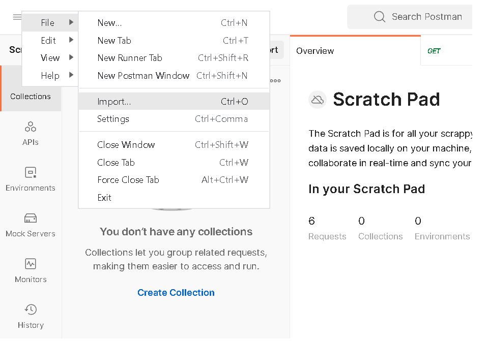
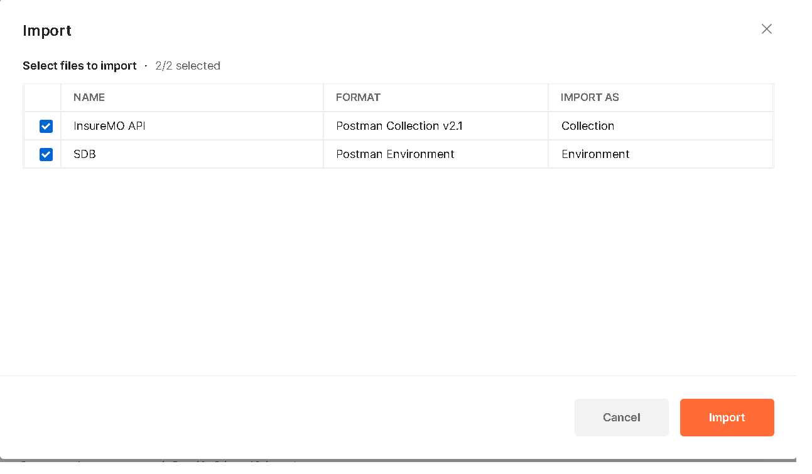
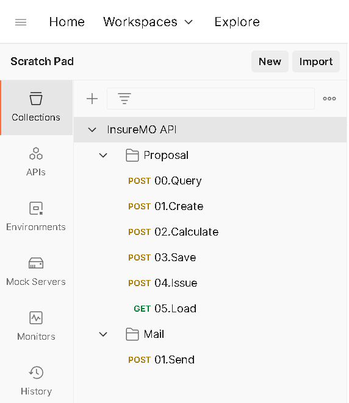
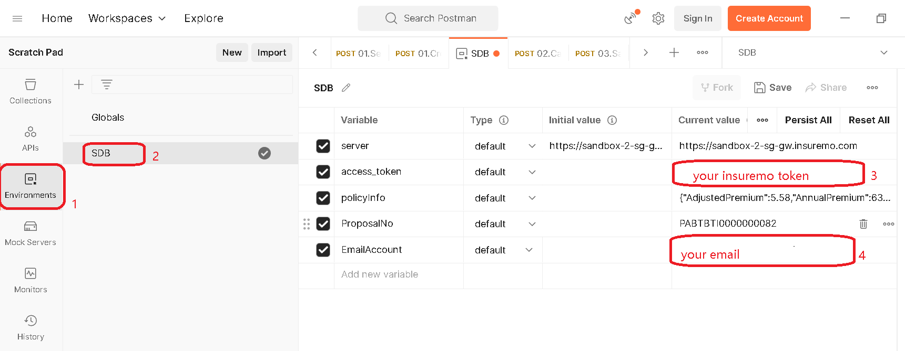
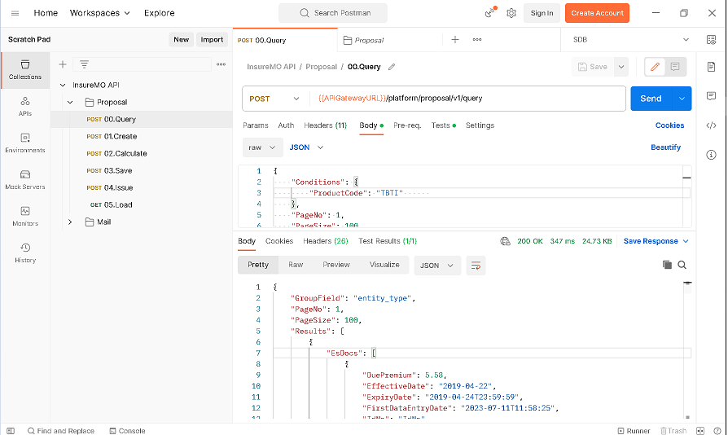

# Calling InsureMO API Sample

This is a sample project to show how to use Postman to invoke InsureMO API. The project includes Postman Collections and Environments files.

## Prerequisite

### Install Postman application
>Download latest [Postman](https://www.postman.com/downloads/) application and install it.

## Run in local

### Step 1: Import the files to Postman
Refer to the following figures to select two files in ./postman directory and click Import button.

The final result like below figure.   

### Step 2: Setup access_token with InsureMO Token and email account.

### Step 3: You can access the API now. Take ***00.Query*** as an example,refer below figure.

### Step 4:Reset Organization.
If you have done all above steps and want to see the policy you created with  User Interface.   
You need to align login user branch code to ebaogi with below steps.    
Menu:  URP->User Manager,Search your login user name ,click Edit button,and set the Organization Name to ebaogi.

