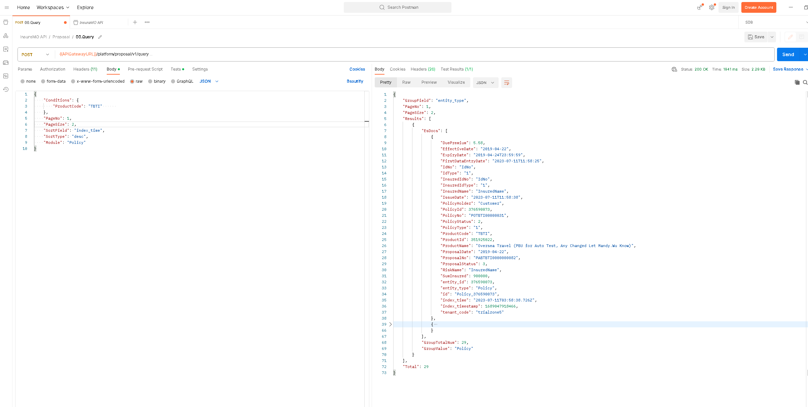

# Calling InsureMO API Sample

This is a sample project to show how to use Postman to invoke InsureMO API. The project includes Postman Collections and Environments files.

## Prerequisite

### Install Postman application
>Download latest [Postman](https://www.postman.com/downloads/) application and install it.

## Run in local

### Step 1: Import the files to Postman
Refer to the following figures to select two files in ./postman directory and click Import button.

### Step 2: Setup access_token with InsureMO Token and email account.

### Step 3: You can access the API now. Take ***00.Query*** as an example,refer below figure.

