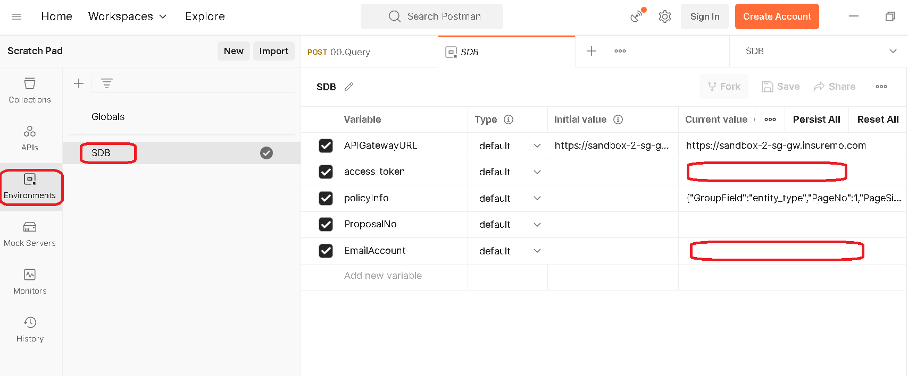

# Calling InsureMO API Sample

This is a sample project to show how to use Postman to invoke InsureMO API. The project includes Postman Collections and Environments files. Please use the ***release*** branch.

## Prerequisite

### Install Postman application
>Download latest [Postman](https://www.postman.com/downloads/) application and install it.

### Generate Personal Access Token
//TODO

### Step 1: Get the sample files
  Clone the repo or download the code as a zip.
> The ***release*** branch is the latest stable version. 

### Step 2: Import the files to Postman
Refer to the following figures to select two files in ./postman directory and click Import button.

### Step 3: Setup access_token with Insuremo Token and email account.
//这个是引用其他readme还是再重头指导user

###  Step 4: You can access the API now

